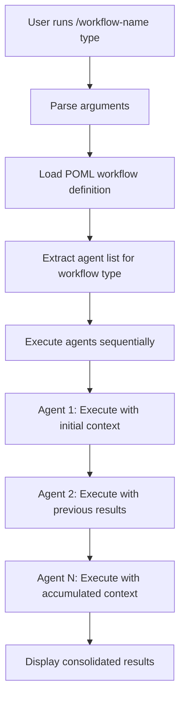

# CC-Flow: Claude Code Workflow Platform

A platform for creating sequential workflow commands that execute Claude Code sub-agents in a structured manner.

## Overview

CC-Flow enables you to create custom slash commands that automatically execute multiple Claude Code sub-agents sequentially, passing context between each step. This creates powerful automation workflows for complex development tasks.

The included `spec` agents are provided as a sample workflow demonstrating specification-driven development. You can create your own agent collections for any domain or workflow pattern.

## Key Features

- **Sequential Sub-agent Execution**: Chain multiple Claude Code agents together
- **Context Passing**: Results from each agent are passed to the next in the sequence
- **Interactive Agent Selection**: Choose which agents to execute and in what order
- **Template-based Command Generation**: Create new workflow commands from templates
- **POML Integration**: Uses POML (Prompt Orchestration Markup Language) for workflow definitions
- **Flexible Workflow Types**: Support for different workflow patterns and agent combinations
- **Error Handling**: Comprehensive validation and error reporting during workflow creation

## Architecture

### Core Components

1. **Templates** (`/templates/`): Base templates for creating new workflow commands
   - `workflow.md`: Markdown template for Claude Code slash commands
   - `workflow.poml`: POML template for workflow orchestration logic

2. **Sub-agents** (`/.claude/agents/`): Specialized agents for different tasks
   - `spec/`: Sample specification-related agents (init, design, implementation, etc.)
   - `utility/`: Utility agents (date handling, POML research, etc.)

3. **Script Architecture** (`/scripts/`): Modular implementation following GitHub spec-kit patterns
   - `create-workflow.sh`: Main entry point with error handling
   - `lib/`: Feature-specific modules (discovery, interaction, processing)
   - `utils/`: Shared utilities and common functions

4. **Command Generator**: The `/create-workflow` command that calls the script architecture

### Workflow Execution Flow



## Usage

### Creating a New Workflow

Use the `/create-workflow` command to generate a new workflow:

```bash
/create-workflow spec
```

**Interactive Agent Selection Process:**

1. **Agent Discovery**: The command scans the specified directory and lists all available agents
```
Found agents in 'spec' directory:
1. spec-init
2. spec-requirements  
3. spec-design
4. spec-tasks
5. spec-impl
6. spec-status
7. steering
8. steering-custom
```

2. **Order Selection**: Choose execution order by entering numbers
```
Enter execution order: 1 2 3 5
```

3. **Confirmation**: Review and confirm your selection
```
Selected execution order:
1. spec-init
2. spec-requirements
3. spec-design
4. spec-impl

Is this correct? (y/n): y
```

4. **Generation**: Creates the workflow command and supporting files
```
✅ Created workflow command: /spec-workflow
📁 Generated files:
   - .claude/commands/spec-workflow.md
   - .claude/commands/poml/spec-workflow.poml

Agent execution order: spec-init → spec-requirements → spec-design → spec-impl
```

**Note**: The `spec` workflow is a sample implementation. You can create workflows for any domain by organizing agents in directories under `/.claude/agents/`.

### Running a Workflow

Execute the generated workflow command:

```bash
/spec-workflow implementation "create authentication system"
```

**Arguments:**
- `implementation`: The workflow type/variant
- `"create authentication system"`: Context description passed to all agents

### Workflow Execution Example

For the `spec` workflow with `implementation` type:

```
→ spec-init: Initializing project structure...
→ spec-requirements: Generating requirements documentation...
→ spec-design: Creating technical design...
→ spec-tasks: Breaking down implementation tasks...
→ spec-impl: Implementing core functionality...
✅ Workflow completed
```

## Sample Sub-agents

### Specification Agents (`/.claude/agents/spec/`) - Sample Implementation

The `spec` agents demonstrate a complete specification-driven development workflow:

- **spec-init**: Initialize new specification with directory structure
- **spec-requirements**: Generate comprehensive requirements using EARS format  
- **spec-design**: Create technical design with research and requirements mapping
- **spec-tasks**: Generate detailed implementation tasks with TDD approach
- **spec-impl**: Execute specification tasks using Kent Beck's TDD methodology
- **spec-status**: Generate progress reports and status tracking
- **steering**: Create and update Kiro steering documents
- **steering-custom**: Create custom steering documents for specialized contexts

### Utility Agents (`/.claude/agents/utility/`)

- **date-utility**: Provides current date and time information
- **poml-spec-researcher**: Research POML specifications and syntax
- **spec-creation-expert**: Create comprehensive technical specifications

**Note**: These agents serve as examples. Create your own agent collections for different domains like testing, deployment, documentation, code review, or any custom workflow you need.

## Template Structure

### Workflow Command Template (`templates/workflow.md`)

Creates a Claude Code slash command with:
- Argument parsing for workflow type and context
- POML integration for dynamic agent selection
- Sequential agent execution with context passing
- Progress reporting and error handling

### POML Template (`templates/workflow.poml`)

Defines the workflow orchestration logic using POML syntax:
- Dynamic agent selection based on workflow type
- Context accumulation between agents
- Structured output formatting
- Workflow-specific instructions and configurations

## Configuration

### Dependencies

- **pomljs**: POML processing library for workflow definitions
- **Claude Code**: Required runtime environment

### File Structure

```
cc-flow/
├── .claude/
│   ├── agents/
│   │   ├── spec/          # Sample specification workflow agents
│   │   └── utility/       # Sample utility agents
│   ├── commands/
│   │   ├── create-workflow.md    # Workflow generator command
│   │   └── poml/                 # Generated POML files (auto-created)
│   └── settings.local.json
├── scripts/               # Modular script architecture (GitHub spec-kit style)
│   ├── create-workflow.sh # Main workflow generator script
│   ├── lib/
│   │   ├── agent-discovery.sh      # Agent discovery and listing
│   │   ├── template-processor.sh   # Template processing and generation
│   │   └── user-interaction.sh     # Interactive order selection
│   └── utils/
│       └── common.sh      # Common utilities and error handling
├── templates/
│   ├── workflow.md        # Command template
│   └── workflow.poml      # POML workflow template
├── docs/
│   └── create-workflow-spec.md    # Detailed implementation specification
├── package.json
└── README.md
```

## Workflow Types

Different workflow types can be defined to execute different combinations of agents:

- **implementation**: Full specification workflow (init → requirements → design → tasks → impl)
- **design-only**: Design-focused workflow (requirements → design)
- **planning**: Planning workflow (init → requirements → tasks)

## Implementation Details

### Script Architecture Benefits

Following GitHub spec-kit patterns provides several advantages:

- **Maintainability**: Logic separated into focused modules
- **Testability**: Each script can be tested independently  
- **Reusability**: Modules can be imported by other scripts
- **Extensibility**: Easy to add new functionality without affecting core logic
- **Error Handling**: Centralized error management and user feedback

### Module Responsibilities

- **agent-discovery.sh**: Finds and validates agent files, extracts metadata
- **user-interaction.sh**: Manages all user input/output, validation, confirmation
- **template-processor.sh**: Handles file I/O, variable substitution, generation
- **common.sh**: Provides consistent error handling, logging, and utilities

### Direct Script Usage

You can also run the script directly for testing or automation:

```bash
# Interactive mode
./scripts/create-workflow.sh spec

# View usage help
./scripts/create-workflow.sh
```

## Extension

### Adding New Agents

1. Create agent definition in `/.claude/agents/{category}/{agent-name}.md`
2. Use `/create-workflow {category}` to generate workflow with interactive selection
3. Test the generated workflow command

### Creating Custom Workflows

1. **Create Agent Directory**: Define your agent sequence in a new directory under `/.claude/agents/`
   ```bash
   mkdir .claude/agents/deploy
   # Add your agents: deploy-build.md, deploy-test.md, deploy-release.md
   ```

2. **Generate Workflow**: Run `/create-workflow {category}` to generate the workflow command
   ```bash
   /create-workflow deploy
   ```

3. **Interactive Selection**: Choose agents and execution order during the creation process

4. **Customize**: Modify the generated POML definitions for your specific use case

**Error Handling**: The creation process includes comprehensive validation:
- Directory existence checking
- Agent file validation
- Duplicate selection prevention
- Template file verification
- Permission checks for file generation

## Development Status

**Status**: Draft/Development
**Version**: 0.1.0

This platform is in active development. Features and APIs may change as the system evolves.