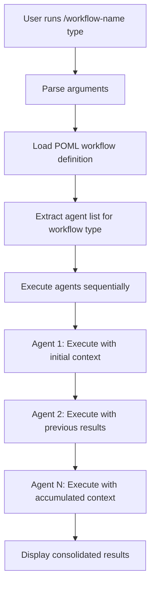

# CC-Flow: Claude Code Workflow Platform

A platform for creating sequential workflow commands that execute Claude Code sub-agents in a structured manner.

## Overview

CC-Flow enables you to create custom slash commands that automatically execute multiple Claude Code sub-agents sequentially, passing context between each step. This creates powerful automation workflows for complex development tasks.

The included `spec` agents are provided as a sample workflow demonstrating specification-driven development. You can create your own agent collections for any domain or workflow pattern.

## Key Features

- **Sequential Sub-agent Execution**: Chain multiple Claude Code agents together
- **Context Passing**: Results from each agent are passed to the next in the sequence
- **Template-based Command Generation**: Create new workflow commands from templates
- **POML Integration**: Uses POML (Prompt Orchestration Markup Language) for workflow definitions
- **Flexible Workflow Types**: Support for different workflow patterns and agent combinations

## Architecture

### Core Components

1. **Templates** (`/templates/`): Base templates for creating new workflow commands
   - `workflow.md`: Markdown template for Claude Code slash commands
   - `workflow.poml`: POML template for workflow orchestration logic

2. **Sub-agents** (`/.claude/agents/`): Specialized agents for different tasks
   - `spec/`: Specification-related agents (init, design, implementation, etc.)
   - `utility/`: Utility agents (date handling, POML research, etc.)

3. **Command Generator**: The `/create-workflow` command that generates new workflow commands

### Workflow Execution Flow



## Usage

### Creating a New Workflow

Use the `/create-workflow` command to generate a new workflow:

```bash
/create-workflow spec
```

This creates a new slash command (e.g., `/spec-workflow`) that executes the agents in the `spec` directory sequentially.

**Note**: The `spec` workflow is a sample implementation. You can create workflows for any domain by organizing agents in directories under `/.claude/agents/`.

### Running a Workflow

Execute the generated workflow command:

```bash
/spec-workflow implementation "create authentication system"
```

**Arguments:**
- `implementation`: The workflow type/variant
- `"create authentication system"`: Context description passed to all agents

### Workflow Execution Example

For the `spec` workflow with `implementation` type:

```
→ spec-init: Initializing project structure...
→ spec-requirements: Generating requirements documentation...
→ spec-design: Creating technical design...
→ spec-tasks: Breaking down implementation tasks...
→ spec-impl: Implementing core functionality...
✅ Workflow completed
```

## Sample Sub-agents

### Specification Agents (`/.claude/agents/spec/`) - Sample Implementation

The `spec` agents demonstrate a complete specification-driven development workflow:

- **spec-init**: Initialize new specification with directory structure
- **spec-requirements**: Generate comprehensive requirements using EARS format  
- **spec-design**: Create technical design with research and requirements mapping
- **spec-tasks**: Generate detailed implementation tasks with TDD approach
- **spec-impl**: Execute specification tasks using Kent Beck's TDD methodology
- **spec-status**: Generate progress reports and status tracking
- **steering**: Create and update Kiro steering documents
- **steering-custom**: Create custom steering documents for specialized contexts

### Utility Agents (`/.claude/agents/utility/`)

- **date-utility**: Provides current date and time information
- **poml-spec-researcher**: Research POML specifications and syntax
- **spec-creation-expert**: Create comprehensive technical specifications

**Note**: These agents serve as examples. Create your own agent collections for different domains like testing, deployment, documentation, code review, or any custom workflow you need.

## Template Structure

### Workflow Command Template (`templates/workflow.md`)

Creates a Claude Code slash command with:
- Argument parsing for workflow type and context
- POML integration for dynamic agent selection
- Sequential agent execution with context passing
- Progress reporting and error handling

### POML Template (`templates/workflow.poml`)

Defines the workflow orchestration logic using POML syntax:
- Dynamic agent selection based on workflow type
- Context accumulation between agents
- Structured output formatting
- Workflow-specific instructions and configurations

## Configuration

### Dependencies

- **pomljs**: POML processing library for workflow definitions
- **Claude Code**: Required runtime environment

### File Structure

```
cc-flow/
├── .claude/
│   ├── agents/
│   │   ├── spec/          # Sample specification workflow agents
│   │   └── utility/       # Sample utility agents
│   └── commands/
│       └── create-workflow.md
├── templates/
│   ├── workflow.md        # Command template
│   └── workflow.poml      # POML workflow template
├── package.json
└── README.md
```

## Workflow Types

Different workflow types can be defined to execute different combinations of agents:

- **implementation**: Full specification workflow (init → requirements → design → tasks → impl)
- **design-only**: Design-focused workflow (requirements → design)
- **planning**: Planning workflow (init → requirements → tasks)

## Extension

### Adding New Agents

1. Create agent definition in `/.claude/agents/{category}/{agent-name}.md`
2. Update workflow templates to include the new agent in relevant workflow types
3. Test the agent integration in your workflow

### Creating Custom Workflows

1. Define your agent sequence in a new directory under `/.claude/agents/`
2. Run `/create-workflow {category}` to generate the workflow command
3. Customize the generated POML definitions for your specific use case

## Development Status

**Status**: Draft/Development
**Version**: 0.1.0

This platform is in active development. Features and APIs may change as the system evolves.