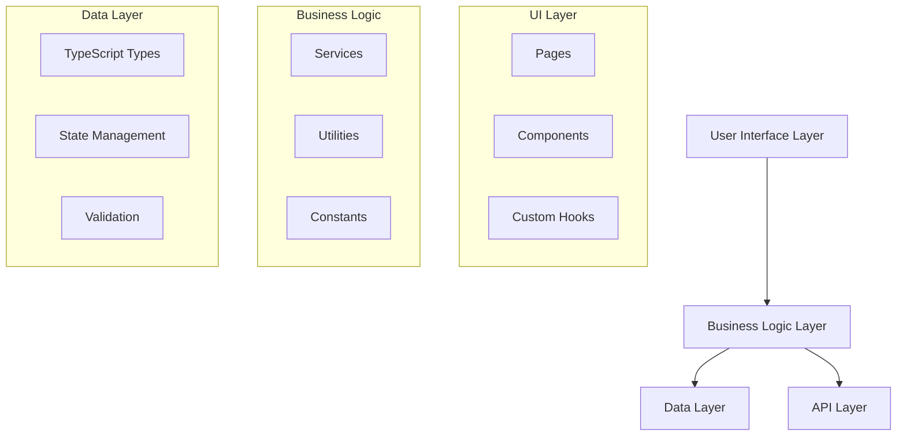
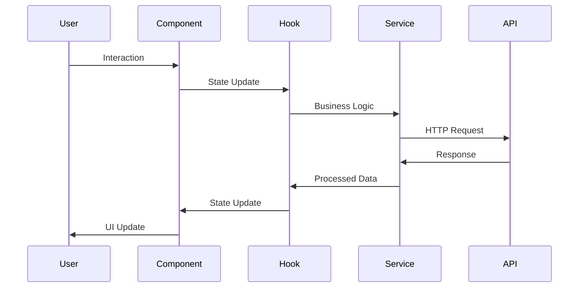
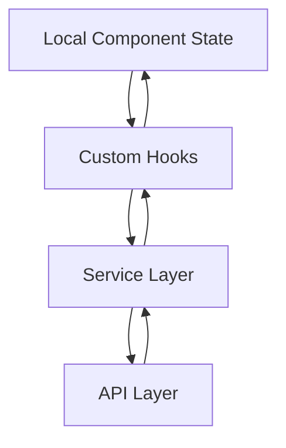
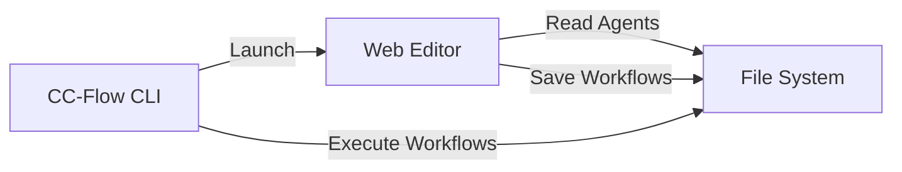

# Technical Architecture

Comprehensive technical architecture documentation for CC-Flow Web Editor.

## 🏗️ System Overview

The CC-Flow Web Editor is a modern Next.js application that provides a visual interface for creating and managing workflow configurations. It leverages a component-based architecture with React 19, TypeScript 5.6, and ReactFlow for visual editing.

### Architecture Principles
- **Component-Based Design**: Reusable, composable UI components
- **Type Safety**: Comprehensive TypeScript coverage
- **Separation of Concerns**: Clear boundaries between UI, business logic, and data
- **Performance First**: Optimized rendering and state management
- **Accessibility**: WCAG 2.1 AA compliance

## 🎯 High-Level Architecture



## 📱 Frontend Architecture

### Component Hierarchy
```
App (layout.tsx)
├── HomePage (/)
└── EditorPage (/editor)
    ├── AgentPalette
    │   ├── AgentCard (draggable)
    │   ├── CategoryFilter
    │   └── SearchInput
    ├── Canvas (ReactFlow)
    │   ├── AgentNode
    │   ├── StepGroupNode
    │   ├── Background
    │   ├── Controls
    │   └── MiniMap
    └── PropertiesPanel
        ├── MetadataForm
        ├── WorkflowStats
        └── JSONPreview
```

### Data Flow Architecture


## 🔧 Technology Stack

### Core Technologies
| Category | Technology | Version | Purpose |
|----------|------------|---------|----------|
| **Framework** | Next.js | 15.5.3 | React framework with SSR/SSG |
| **UI Library** | React | 19.1.0 | Component-based UI |
| **Language** | TypeScript | 5.6 | Type safety and development experience |
| **Visual Editor** | ReactFlow | 12.8.5 | Interactive node-based editor |
| **Styling** | Tailwind CSS | 4.0 | Utility-first CSS framework |
| **UI Components** | shadcn/ui | Latest | Accessible component library |
| **State Management** | React Built-in | - | Hooks-based state management |

### Development Tools
| Category | Technology | Purpose |
|----------|------------|----------|
| **Testing** | Vitest | Unit and integration testing |
| **Testing** | React Testing Library | Component testing utilities |
| **Mocking** | MSW | API mocking for tests |
| **Linting** | ESLint | Code quality and standards |
| **Formatting** | Prettier | Code formatting |
| **Type Checking** | TypeScript Compiler | Static type checking |

## 🎛️ Component Architecture

### 1. Custom Hooks Pattern
Central to the application's state management strategy:

```typescript
// Core hook for workflow editing
export function useWorkflowEditor(): UseWorkflowEditorReturn {
  const [nodes, setNodes] = useState<WorkflowNode[]>([]);
  const [edges, setEdges] = useState<WorkflowEdge[]>([]);
  const [metadata, setMetadata] = useState<WorkflowMetadata>(DEFAULT_METADATA);

  const handleNodesChange = useCallback((newNodes: WorkflowNode[]) => {
    setNodes(newNodes);
  }, []);

  const generatePreviewJSON = useMemo(() => {
    return () => JSON.stringify({ ...metadata, workflowSteps: [...] }, null, 2);
  }, [metadata, nodes]);

  return {
    nodes, edges, metadata,
    handleNodesChange,
    generatePreviewJSON,
    canSave: Boolean(metadata.workflowName?.trim() && nodes.length > 0)
  };
}
```

### 2. Service Layer Pattern
Abstraction for external interactions:

```typescript
export class WorkflowService {
  private static readonly BASE_URL = '/api/workflows';

  static async saveWorkflow(data: WorkflowSaveRequest): Promise<WorkflowSaveResponse> {
    const response = await fetch(this.BASE_URL, {
      method: 'POST',
      headers: { 'Content-Type': 'application/json' },
      body: JSON.stringify(data),
    });

    if (!response.ok) {
      const errorData = await response.json().catch(() => ({}));
      throw new Error(errorData.error || `HTTP ${response.status}`);
    }

    return response.json();
  }
}
```

### 3. Component Composition
Flexible and reusable component design:

```typescript
interface CanvasProps {
  nodes: WorkflowNode[];
  edges: WorkflowEdge[];
  onNodesChange: (nodes: WorkflowNode[]) => void;
  onEdgesChange: (edges: WorkflowEdge[]) => void;
  onConnect: (connection: Connection) => void;
}

export default function Canvas({ nodes, edges, onNodesChange, onEdgesChange, onConnect }: CanvasProps) {
  return (
    <ReactFlowProvider>
      <ReactFlow
        nodes={nodes}
        edges={edges}
        onNodesChange={(changes) => onNodesChange(applyNodeChanges(changes, nodes))}
        onEdgesChange={(changes) => onEdgesChange(applyEdgeChanges(changes, edges))}
        onConnect={onConnect}
        nodeTypes={{ agent: AgentNode, 'step-group': StepGroupNode }}
      >
        <Background />
        <Controls />
        <MiniMap />
      </ReactFlow>
    </ReactFlowProvider>
  );
}
```

## 🗄️ Data Architecture

### Type System
Comprehensive TypeScript definitions ensure type safety:

```typescript
// Workflow data types
export interface WorkflowMetadata {
  workflowName: string;
  workflowPurpose: string;
  workflowModel?: string;
  workflowArgumentHint?: string;
}

export interface AgentNodeData extends Record<string, unknown> {
  agentName: string;
  agentPath?: string;
  label: string;
  description?: string;
}

export interface WorkflowNode {
  id: string;
  type: 'agent' | 'step-group' | 'start' | 'end';
  data: WorkflowNodeData;
  position: { x: number; y: number };
}

// Type guards for runtime safety
export function isAgentNodeData(data: WorkflowNodeData): data is AgentNodeData {
  return 'agentName' in data;
}
```

### State Management Strategy


## 🔌 API Architecture

### Backend Structure
```
/api/
├── agents/
│   └── route.ts          # GET /api/agents
└── workflows/
    └── route.ts          # POST /api/workflows
```

### API Design Patterns
```typescript
// Standardized API response format
interface APIResponse<T> {
  success: boolean;
  data?: T;
  error?: string;
  message?: string;
}

// Agent discovery endpoint
export async function GET(request: NextRequest) {
  try {
    const agentsPath = join(process.cwd(), AGENTS_BASE_PATH);
    const allAgents = await scanAgentsDirectory(agentsPath);
    
    const response: AgentsResponse = {
      categories: groupAgentsByCategory(allAgents)
    };
    
    return NextResponse.json(response);
  } catch (error) {
    return NextResponse.json(
      { error: 'Failed to fetch agents' },
      { status: 500 }
    );
  }
}
```

### Workflow Serialization Schema
The workflow persistence endpoint produces a structured JSON document that mirrors the canvas topology:

```json
{
  "workflowName": "sample-workflow",
  "workflowPurpose": "Draft specification",
  "workflowModel": "claude-3-sonnet",
  "workflowArgumentHint": "<context>",
  "startNode": {
    "id": "start-node",
    "label": "Start",
    "description": "Entry point"
  },
  "endNode": {
    "id": "end-node",
    "label": "End",
    "description": "Exit summary"
  },
  "agents": [
    {
      "id": "agent-1",
      "label": "Spec Agent",
      "agentName": "spec-agent",
      "agentPath": "./agents/spec/spec-agent.md"
    }
  ],
  "stepGroups": [
    {
      "id": "group-1",
      "title": "Draft",
      "mode": "sequential",
      "agents": ["spec-agent"]
    }
  ],
  "nodes": [/* full ReactFlow node payload */],
  "edges": [
    {
      "id": "edge-start-agent",
      "source": "start-node",
      "target": "agent-1",
      "type": "default"
    }
  ]
}
```

Validation rules enforce exactly one start node, exactly one end node, and at least one agent node before the workflow is written to disk. Additional node metadata remains embedded in the `nodes` array for round-trip fidelity.


## 🎨 UI Architecture

### Design System
Built on shadcn/ui with Tailwind CSS:

```typescript
// Base UI components
export interface CardProps extends React.HTMLAttributes<HTMLDivElement> {
  children: React.ReactNode;
  className?: string;
}

export const Card = React.forwardRef<HTMLDivElement, CardProps>(
  ({ className, children, ...props }, ref) => (
    <div
      ref={ref}
      className={cn(
        "rounded-lg border bg-card text-card-foreground shadow-sm",
        className
      )}
      {...props}
    >
      {children}
    </div>
  )
);
```

### Responsive Design
- **Mobile First**: Tailwind CSS mobile-first approach
- **Breakpoints**: sm (640px), md (768px), lg (1024px), xl (1280px)
- **Fluid Typography**: Responsive text sizing
- **Flexible Layouts**: CSS Grid and Flexbox

### Accessibility Features
- **Keyboard Navigation**: Full keyboard support
- **Screen Reader Support**: ARIA labels and roles
- **Color Contrast**: WCAG AA compliant colors
- **Focus Management**: Visible focus indicators

## 🔄 Integration Architecture

### CC-Flow CLI Integration


### File System Integration
```typescript
// Agent discovery from file system
const AGENTS_BASE_PATH = process.env.AGENTS_PATH || '../.claude/agents';

async function scanAgentsDirectory(dirPath: string): Promise<Agent[]> {
  const agents: Agent[] = [];
  const entries = await readdir(dirPath);
  
  for (const entry of entries) {
    const fullPath = join(dirPath, entry);
    const stats = await stat(fullPath);
    
    if (stats.isDirectory()) {
      const subAgents = await scanAgentsDirectory(fullPath);
      agents.push(...subAgents);
    } else if (extname(entry) === '.md') {
      const agent = await parseAgentFile(fullPath);
      agents.push(agent);
    }
  }
  
  return agents;
}
```

## 🚀 Performance Architecture

### Optimization Strategies
1. **React Performance**
   - React.memo for expensive components
   - useCallback for stable function references
   - useMemo for expensive calculations
   - Code splitting for large components

2. **Bundle Optimization**
   - Next.js automatic code splitting
   - Dynamic imports for heavy components
   - Tree shaking for unused code
   - Optimized asset loading

3. **Runtime Performance**
   - Virtual scrolling for large lists
   - Debounced search and filtering
   - Optimistic UI updates
   - Efficient re-rendering patterns

### Performance Monitoring
```typescript
// Performance measurement hooks
export function usePerformanceMonitor(componentName: string) {
  useEffect(() => {
    const start = performance.now();
    return () => {
      const end = performance.now();
      console.log(`${componentName} render time: ${end - start}ms`);
    };
  });
}
```

## 🔒 Security Architecture

### Frontend Security
- **XSS Protection**: Sanitized user inputs
- **CSRF Protection**: Next.js built-in protection
- **Type Safety**: TypeScript prevents many runtime errors
- **Input Validation**: Client and server-side validation

### API Security
```typescript
// Input validation middleware
function validateWorkflowRequest(body: unknown): WorkflowSaveRequest {
  if (!body || typeof body !== 'object') {
    throw new Error('Invalid request body');
  }
  
  const { metadata, nodes, edges } = body as any;
  
  if (!metadata?.workflowName?.trim()) {
    throw new Error('Workflow name is required');
  }
  
  return { metadata, nodes: nodes || [], edges: edges || [] };
}
```

## 📦 Deployment Architecture

### Build Process
```bash
# Production build pipeline
npm run type-check    # TypeScript validation
npm run lint         # Code quality checks
npm run test:run     # Test suite execution
npm run build        # Next.js production build
```

### Environment Configuration
```typescript
// Environment-specific configuration
const config = {
  development: {
    apiUrl: 'http://localhost:3002',
    agentsPath: '../.claude/agents',
  },
  production: {
    apiUrl: process.env.NEXT_PUBLIC_API_URL,
    agentsPath: process.env.AGENTS_PATH,
  },
};
```

## 📈 Scalability Considerations

### Current Limitations
- File system-based agent discovery
- In-memory workflow storage
- Single-user design

### Future Scalability
- Database integration for multi-user support
- Cloud storage for workflows
- Real-time collaboration features
- Microservices architecture for complex deployments

## 🔮 Future Architecture

### Planned Enhancements
1. **Backend Services**
   - Database integration (PostgreSQL)
   - Authentication system
   - Real-time collaboration (WebSockets)

2. **Frontend Enhancements**
   - Progressive Web App (PWA)
   - Offline support
   - Advanced visualization

3. **Integration Improvements**
   - Plugin system
   - Third-party integrations
   - API versioning

---

**Architecture Version**: 2.0
**Last Updated**: 2025-01-26
**Next Review**: Q2 2025