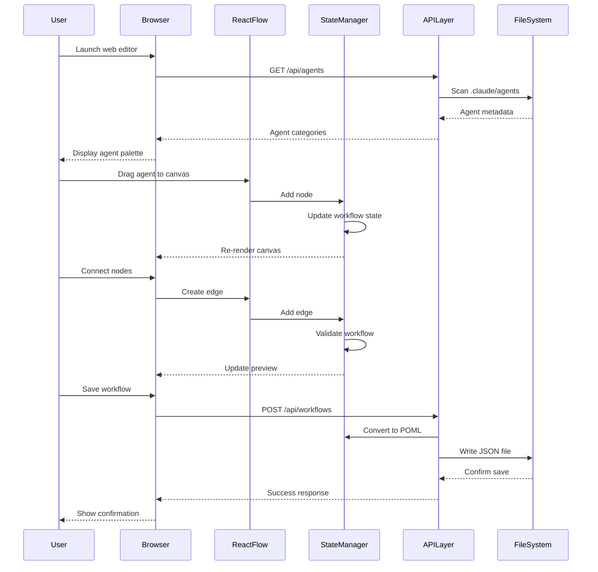
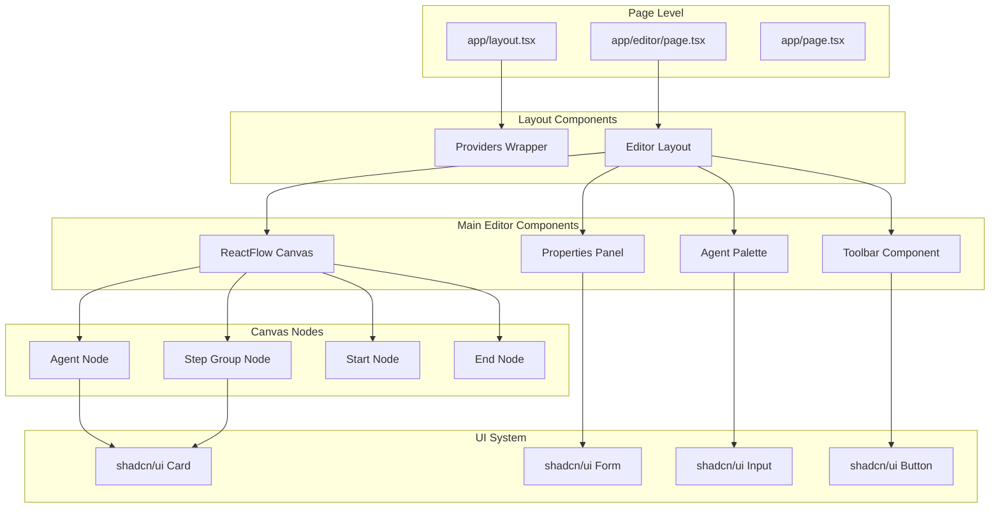
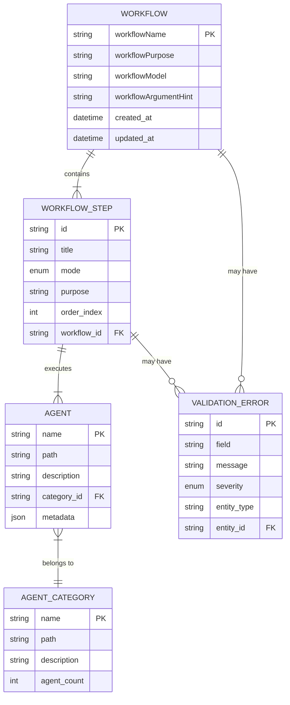

# CC-Flow Web Editor - Technical Design Specification

## Overview

The CC-Flow Web Editor is a comprehensive Next.js 15 web application for visually designing and managing complex workflow configurations. Built with ReactFlow for visual editing, shadcn/ui for design system components, and seamless integration with the existing cc-flow CLI ecosystem, this application provides an intuitive alternative to the command-line interface for workflow creation.

## Requirements Mapping

### Core User Stories Addressed

1. **Visual Workflow Creation**: Users can drag-and-drop agents onto a canvas to visually design workflows
2. **Real-time Editing**: Users see immediate feedback as they modify workflows with live preview
3. **Agent Management**: Users can browse, search, and organize available agents by category
4. **Workflow Persistence**: Users can save and load workflow configurations in JSON format
5. **CLI Integration**: Users can launch the web editor from the cc-flow CLI and seamlessly export configurations

### Technical Requirements Coverage

- **REQ-001**: Visual workflow editor with ReactFlow canvas ✅
- **REQ-002**: Agent palette with drag-and-drop functionality ✅
- **REQ-003**: Properties panel for workflow metadata editing ✅
- **REQ-004**: Real-time JSON preview and validation ✅
- **REQ-005**: File system integration for agent discovery ✅
- **REQ-006**: Workflow saving and loading capabilities ✅

## Architecture

### System Architecture Overview

```mermaid
graph TB
    subgraph "cc-flow CLI Ecosystem"
        CLI[cc-flow CLI] --> WEB[Web Editor Launch]
        CLI --> AGENTS[Agent Discovery]
    end

    subgraph "Next.js 15 Application"
        WEB --> BROWSER[Browser Instance]
        BROWSER --> FRONTEND[Frontend Layer]

        subgraph "Frontend Layer"
            FRONTEND --> CANVAS[ReactFlow Canvas]
            FRONTEND --> PALETTE[Agent Palette]
            FRONTEND --> PROPS[Properties Panel]
            FRONTEND --> TOOLBAR[Toolbar & Controls]
        end

        subgraph "Application Layer"
            CANVAS --> STATE[State Management]
            PALETTE --> STATE
            PROPS --> STATE
            STATE --> VALIDATION[Validation Engine]
            STATE --> CONVERTER[Workflow Converter]
        end

        subgraph "API Layer"
            STATE --> AGENTAPI[/api/agents]
            STATE --> WORKFLOWAPI[/api/workflows]
            AGENTAPI --> FS[File System]
            WORKFLOWAPI --> FS
        end
    end

    subgraph "File System"
        FS --> AGENTFILES[.claude/agents/**/*.md]
        FS --> WORKFLOWFILES[workflows/*.json]
    end
```

### Technology Stack

**Frontend Framework**: Next.js 15 with App Router
- **Rationale**: Latest Next.js provides optimal performance with React Server Components, improved caching strategies, and streamlined development experience
- **Benefits**: Server-side rendering for SEO, built-in API routes, excellent TypeScript support
- **Trade-offs**: Learning curve for App Router patterns, but future-proofed architecture

**Visual Editor**: ReactFlow (XyFlow) v12.8.5
- **Rationale**: Industry-standard for node-based visual editors with proven scalability
- **Benefits**: Built-in drag-and-drop, customizable nodes/edges, performance optimizations for large graphs
- **Trade-offs**: Bundle size impact, but comprehensive feature set justifies inclusion

**UI Framework**: shadcn/ui + Radix UI + Tailwind CSS
- **Rationale**: Modern component architecture with copy-paste philosophy ensures full control and customization
- **Benefits**: Type-safe components, accessibility built-in, no dependency lock-in, AI-friendly architecture
- **Trade-offs**: Initial setup overhead, but provides long-term maintainability

**State Management**: React 19 built-in state + Custom hooks
- **Rationale**: For the current scope, React's built-in state management is sufficient
- **Benefits**: Reduces complexity, leverages React 19 improvements, easier testing
- **Future consideration**: Zustand for complex state scenarios

**Type System**: TypeScript 5.6
- **Rationale**: Essential for large-scale React applications and API integration
- **Benefits**: Compile-time error detection, excellent IDE support, improved refactoring
- **Trade-offs**: Initial development overhead, but critical for maintainability

**Testing Strategy**: Vitest + Testing Library + Playwright
- **Rationale**: Modern testing stack aligned with Next.js 15 recommendations
- **Benefits**: Fast test execution, component testing, end-to-end testing coverage

## Data Flow Architecture

### Primary User Flow - Workflow Creation



### State Management Pattern

```typescript
// Centralized workflow state management
interface WorkflowState {
  // Visual elements
  nodes: WorkflowNode[];
  edges: WorkflowEdge[];

  // Metadata
  metadata: WorkflowMetadata;

  // UI state
  selectedNode: string | null;
  selectedEdge: string | null;
  isValidating: boolean;
  errors: ValidationError[];

  // Derived state
  workflowJSON: string;
  isValid: boolean;
}

// State update patterns
const useWorkflowState = () => {
  const [state, setState] = useState<WorkflowState>(initialState);

  // Atomic updates with validation
  const updateNodes = useCallback((nodes: WorkflowNode[]) => {
    setState(prev => {
      const newState = { ...prev, nodes };
      return {
        ...newState,
        workflowJSON: generateJSON(newState),
        isValid: validateWorkflow(newState)
      };
    });
  }, []);

  return { state, updateNodes, /* other updaters */ };
};
```

## Component Architecture

### Component Hierarchy and Relationships



### Backend Services & Method Signatures

```typescript
// Agent Discovery Service
class AgentDiscoveryService {
  /**
   * Scans the file system for available agents
   * @param basePath - Root path for agent discovery
   * @returns Promise<AgentsResponse> - Categorized agent data
   */
  async scanAgents(basePath: string): Promise<AgentsResponse>;

  /**
   * Parses individual agent markdown files
   * @param filePath - Path to agent markdown file
   * @returns Promise<Agent> - Parsed agent metadata
   */
  async parseAgentFile(filePath: string): Promise<Agent>;

  /**
   * Validates agent file structure
   * @param content - Raw markdown content
   * @returns ValidationResult - Validation status and errors
   */
  validateAgentStructure(content: string): ValidationResult;
}

// Workflow Conversion Service
class WorkflowConverterService {
  /**
   * Converts ReactFlow data to CC-Flow JSON format
   * @param nodes - ReactFlow nodes array
   * @param edges - ReactFlow edges array
   * @param metadata - Workflow metadata
   * @returns POMLWorkflow - Converted workflow configuration
   */
  convertToPOML(
    nodes: WorkflowNode[],
    edges: WorkflowEdge[],
    metadata: WorkflowMetadata
  ): POMLWorkflow;

  /**
   * Validates workflow structure and dependencies
   * @param workflow - Complete workflow configuration
   * @returns ValidationResult - Validation status and errors
   */
  validateWorkflow(workflow: POMLWorkflow): ValidationResult;

  /**
   * Generates execution order from graph structure
   * @param nodes - ReactFlow nodes
   * @param edges - ReactFlow edges
   * @returns WorkflowStep[] - Ordered execution steps
   */
  generateExecutionOrder(nodes: WorkflowNode[], edges: WorkflowEdge[]): WorkflowStep[];
}

// File System Service
class FileSystemService {
  /**
   * Saves workflow to file system
   * @param workflow - Workflow configuration
   * @param outputPath - Target file path
   * @returns Promise<SaveResult> - Save operation result
   */
  async saveWorkflow(workflow: POMLWorkflow, outputPath: string): Promise<SaveResult>;

  /**
   * Loads existing workflow from file
   * @param filePath - Source file path
   * @returns Promise<POMLWorkflow> - Loaded workflow configuration
   */
  async loadWorkflow(filePath: string): Promise<POMLWorkflow>;

  /**
   * Lists available saved workflows
   * @param directory - Workflows directory
   * @returns Promise<WorkflowSummary[]> - List of saved workflows
   */
  async listWorkflows(directory: string): Promise<WorkflowSummary[]>;
}
```

### Frontend Component Specifications

| Component | Responsibility | Props/State Summary |
|-----------|---------------|-------------------|
| **EditorPage** | Main layout orchestration | `nodes[], edges[], metadata, handlers` |
| **ReactFlowCanvas** | Visual workflow editing | `nodes[], edges[], onNodesChange, onEdgesChange` |
| **AgentPalette** | Agent browsing and search | `agents[], selectedCategory, searchQuery` |
| **PropertiesPanel** | Metadata and node editing | `selectedNode, metadata, validationErrors` |
| **AgentNode** | Custom ReactFlow node | `data: AgentNodeData, selected, dragging` |
| **StepGroupNode** | Group node rendering | `data: StepGroupNodeData, expanded, children[]` |
| **WorkflowToolbar** | Action buttons and status | `canSave, validationStatus, workflowName` |
| **PreviewModal** | JSON output display | `workflowJSON, isOpen, onClose` |

## API Design and Integration Patterns

### API Endpoint Specifications

| Method | Route | Purpose | Auth | Request Body | Response | Status Codes |
|--------|-------|---------|------|--------------|----------|--------------|
| GET | `/api/agents` | List available agents | None | N/A | `AgentsResponse` | 200, 500 |
| GET | `/api/agents/[category]` | Get category agents | None | N/A | `Agent[]` | 200, 404, 500 |
| POST | `/api/workflows` | Save workflow | None | `SaveWorkflowRequest` | `SaveWorkflowResponse` | 201, 400, 500 |
| GET | `/api/workflows` | List saved workflows | None | N/A | `WorkflowSummary[]` | 200, 500 |
| GET | `/api/workflows/[id]` | Load specific workflow | None | N/A | `POMLWorkflow` | 200, 404, 500 |
| POST | `/api/workflows/validate` | Validate workflow | None | `ValidateRequest` | `ValidationResult` | 200, 400, 500 |
| DELETE | `/api/workflows/[id]` | Delete workflow | None | N/A | `DeleteResult` | 204, 404, 500 |

### API Integration Patterns

```typescript
// Centralized API client with error handling
class APIClient {
  private baseURL = process.env.NODE_ENV === 'production' ? '' : 'http://localhost:3000';

  async request<T>(
    endpoint: string,
    options: RequestInit = {}
  ): Promise<APIResponse<T>> {
    try {
      const response = await fetch(`${this.baseURL}${endpoint}`, {
        headers: {
          'Content-Type': 'application/json',
          ...options.headers,
        },
        ...options,
      });

      if (!response.ok) {
        throw new APIError(response.status, await response.text());
      }

      return { success: true, data: await response.json() };
    } catch (error) {
      return { success: false, error: error.message };
    }
  }

  // Typed methods for each endpoint
  async getAgents(): Promise<APIResponse<AgentsResponse>> {
    return this.request<AgentsResponse>('/api/agents');
  }

  async saveWorkflow(request: SaveWorkflowRequest): Promise<APIResponse<SaveWorkflowResponse>> {
    return this.request<SaveWorkflowResponse>('/api/workflows', {
      method: 'POST',
      body: JSON.stringify(request),
    });
  }
}
```

## Data Models and Type System

### Domain Entities

1. **Agent**: Represents an individual workflow component
2. **WorkflowStep**: Groups of agents executed together
3. **Workflow**: Complete workflow configuration
4. **AgentCategory**: Organizational grouping of agents
5. **ValidationError**: Error information for workflow validation

### Entity Relationships



### TypeScript Model Definitions

```typescript
// Core Domain Types
interface Agent {
  name: string;
  path: string;
  description: string;
  category: string;
  metadata?: {
    tools?: string[];
    language?: string;
    complexity?: 'low' | 'medium' | 'high';
    tags?: string[];
  };
}

interface WorkflowStep {
  id: string;
  title: string;
  mode: 'sequential' | 'parallel';
  purpose: string;
  agents: string[];
  order: number;
  conditions?: {
    if?: string;
    skipIf?: string;
    retryCount?: number;
  };
}

interface WorkflowMetadata {
  workflowName: string;
  workflowPurpose: string;
  workflowModel?: string;
  workflowArgumentHint?: string;
  version?: string;
  author?: string;
  tags?: string[];
  created_at?: Date;
  updated_at?: Date;
}

interface POMLWorkflow extends WorkflowMetadata {
  workflowSteps: WorkflowStep[];
}

// ReactFlow Integration Types
interface AgentNodeData {
  agentName: string;
  agentPath: string;
  label: string;
  description: string;
  category: string;
  tools: string[];
  isSelected: boolean;
}

interface StepGroupNodeData {
  title: string;
  mode: 'sequential' | 'parallel';
  purpose: string;
  agents: string[];
  label: string;
  description: string;
  isExpanded: boolean;
  childNodes: string[];
}

type WorkflowNodeData = AgentNodeData | StepGroupNodeData;

interface WorkflowNode extends Node {
  id: string;
  type: 'agent' | 'step-group' | 'start' | 'end';
  data: WorkflowNodeData;
  position: { x: number; y: number };
}

interface WorkflowEdge extends Edge {
  id: string;
  source: string;
  target: string;
  type: 'default' | 'conditional' | 'error-handler';
  data?: {
    condition?: string;
    label?: string;
    isRequired?: boolean;
  };
}

// API Types
interface AgentsResponse {
  categories: Record<string, AgentCategory>;
  totalCount: number;
}

interface SaveWorkflowRequest {
  metadata: WorkflowMetadata;
  nodes: WorkflowNode[];
  edges: WorkflowEdge[];
  outputPath?: string;
}

interface SaveWorkflowResponse {
  success: boolean;
  message: string;
  filename: string;
  path: string;
  workflow: POMLWorkflow;
}

interface ValidationResult {
  isValid: boolean;
  errors: ValidationError[];
  warnings: ValidationError[];
}

interface ValidationError {
  field: string;
  message: string;
  severity: 'error' | 'warning' | 'info';
  code: string;
  context?: Record<string, any>;
}
```

### Database Schema (Future Consideration)

```sql
-- For future cloud/multi-user scenarios
CREATE TABLE workflows (
  id UUID PRIMARY KEY DEFAULT uuid_generate_v4(),
  name VARCHAR(255) NOT NULL,
  purpose TEXT NOT NULL,
  model VARCHAR(100),
  argument_hint TEXT,
  version VARCHAR(20) DEFAULT '1.0.0',
  author VARCHAR(255),
  tags TEXT[],
  metadata JSONB,
  created_at TIMESTAMP WITH TIME ZONE DEFAULT NOW(),
  updated_at TIMESTAMP WITH TIME ZONE DEFAULT NOW()
);

CREATE TABLE workflow_steps (
  id UUID PRIMARY KEY DEFAULT uuid_generate_v4(),
  workflow_id UUID REFERENCES workflows(id) ON DELETE CASCADE,
  title VARCHAR(255) NOT NULL,
  mode VARCHAR(20) NOT NULL CHECK (mode IN ('sequential', 'parallel')),
  purpose TEXT,
  agents TEXT[] NOT NULL,
  order_index INTEGER NOT NULL,
  conditions JSONB,
  created_at TIMESTAMP WITH TIME ZONE DEFAULT NOW()
);

CREATE TABLE agents (
  name VARCHAR(255) PRIMARY KEY,
  path TEXT NOT NULL,
  description TEXT NOT NULL,
  category VARCHAR(100) NOT NULL,
  metadata JSONB,
  last_modified TIMESTAMP WITH TIME ZONE DEFAULT NOW()
);

CREATE INDEX idx_workflows_author ON workflows(author);
CREATE INDEX idx_workflows_tags ON workflows USING GIN(tags);
CREATE INDEX idx_workflow_steps_workflow_id ON workflow_steps(workflow_id);
CREATE INDEX idx_workflow_steps_order ON workflow_steps(workflow_id, order_index);
CREATE INDEX idx_agents_category ON agents(category);
```

## Error Handling Strategy

### Error Classification and Response Patterns

```typescript
// Centralized error handling with typed errors
class AppError extends Error {
  constructor(
    public code: string,
    public message: string,
    public severity: 'low' | 'medium' | 'high' | 'critical',
    public context?: Record<string, any>
  ) {
    super(message);
    this.name = 'AppError';
  }
}

// Specific error types
class ValidationError extends AppError {
  constructor(field: string, message: string, value?: any) {
    super(
      'VALIDATION_ERROR',
      message,
      'medium',
      { field, value }
    );
  }
}

class FileSystemError extends AppError {
  constructor(operation: string, path: string, originalError: Error) {
    super(
      'FILE_SYSTEM_ERROR',
      `Failed to ${operation} file: ${path}`,
      'high',
      { operation, path, originalError: originalError.message }
    );
  }
}

class WorkflowConversionError extends AppError {
  constructor(stage: string, details: string) {
    super(
      'WORKFLOW_CONVERSION_ERROR',
      `Workflow conversion failed at ${stage}: ${details}`,
      'high',
      { stage, details }
    );
  }
}

// Error boundary component
class ErrorBoundary extends Component<
  { children: ReactNode; fallback?: ReactNode },
  { hasError: boolean; error?: Error }
> {
  constructor(props: any) {
    super(props);
    this.state = { hasError: false };
  }

  static getDerivedStateFromError(error: Error) {
    return { hasError: true, error };
  }

  componentDidCatch(error: Error, errorInfo: ErrorInfo) {
    console.error('React Error Boundary caught an error:', error, errorInfo);

    // Log to monitoring service in production
    if (process.env.NODE_ENV === 'production') {
      this.logError(error, errorInfo);
    }
  }

  render() {
    if (this.state.hasError) {
      return this.props.fallback || (
        <div className="p-6 text-center">
          <h2 className="text-xl font-semibold text-red-600 mb-2">
            Something went wrong
          </h2>
          <p className="text-gray-600 mb-4">
            An unexpected error occurred. Please refresh the page and try again.
          </p>
          <Button onClick={() => window.location.reload()}>
            Refresh Page
          </Button>
        </div>
      );
    }

    return this.props.children;
  }
}

// API error handling middleware
async function handleAPIError(error: any, req: NextRequest): Promise<NextResponse> {
  if (error instanceof ValidationError) {
    return NextResponse.json(
      {
        error: error.message,
        code: error.code,
        field: error.context?.field
      },
      { status: 400 }
    );
  }

  if (error instanceof FileSystemError) {
    return NextResponse.json(
      {
        error: 'File operation failed',
        code: error.code
      },
      { status: 500 }
    );
  }

  // Default error response
  console.error('Unhandled API error:', error);
  return NextResponse.json(
    {
      error: 'Internal server error',
      code: 'INTERNAL_ERROR'
    },
    { status: 500 }
  );
}
```

## Security Considerations

### Local Environment Security Model

```typescript
// Path traversal prevention
function sanitizePath(userPath: string, basePath: string): string {
  const normalizedPath = path.normalize(userPath);
  const absoluteBasePath = path.resolve(basePath);
  const absoluteUserPath = path.resolve(absoluteBasePath, normalizedPath);

  if (!absoluteUserPath.startsWith(absoluteBasePath)) {
    throw new SecurityError('Path traversal attempt detected');
  }

  return absoluteUserPath;
}

// Input validation and sanitization
const workflowSchema = z.object({
  workflowName: z.string()
    .min(1, 'Workflow name is required')
    .max(100, 'Workflow name too long')
    .regex(/^[a-zA-Z0-9\-_\s]+$/, 'Invalid characters in workflow name'),
  workflowPurpose: z.string()
    .min(1, 'Workflow purpose is required')
    .max(500, 'Workflow purpose too long'),
  workflowModel: z.string().optional(),
  workflowArgumentHint: z.string().max(200).optional(),
});

// XSS prevention for user content
function sanitizeUserContent(content: string): string {
  return DOMPurify.sanitize(content, {
    ALLOWED_TAGS: ['p', 'br', 'strong', 'em', 'code'],
    ALLOWED_ATTR: []
  });
}

// File extension validation
const ALLOWED_EXTENSIONS = ['.json', '.md'] as const;
const ALLOWED_MIME_TYPES = ['application/json', 'text/markdown'] as const;

function validateFileType(filename: string, mimeType: string): boolean {
  const extension = path.extname(filename).toLowerCase();
  return ALLOWED_EXTENSIONS.includes(extension as any) &&
         ALLOWED_MIME_TYPES.includes(mimeType as any);
}
```

### Security Implementation Checklist

- ✅ **Input Validation**: Zod schemas for all user inputs
- ✅ **Path Traversal Protection**: Sanitized file paths with base path validation
- ✅ **XSS Prevention**: Content sanitization for user-generated content
- ✅ **File Type Validation**: Restricted file extensions and MIME types
- ✅ **Error Information Disclosure**: Generic error messages to users
- ✅ **Local-Only Operation**: No external network requests by design
- ⚠️ **Future Consideration**: Rate limiting for API endpoints
- ⚠️ **Future Consideration**: CSRF protection for form submissions

## Performance & Scalability

### Performance Targets

| Metric | Target | Measurement Method | Rationale |
|--------|--------|-------------------|-----------|
| **Initial Load Time** | < 2 seconds | Core Web Vitals | Critical for user engagement |
| **Agent Discovery** | < 1 second | API response time | Impacts initial user experience |
| **Canvas Rendering** | < 500ms | ReactFlow init time | Smooth editing experience |
| **Node Addition** | < 100ms | User interaction | Real-time feel |
| **Workflow Save** | < 3 seconds | E2E operation | Acceptable for save operation |
| **Large Workflow (100+ nodes)** | < 1 second | Canvas navigation | Support complex workflows |

### Caching Strategy

```typescript
// Browser-level caching
const cacheConfig = {
  // Static assets - long-term caching
  staticAssets: {
    maxAge: '1y',
    cacheControl: 'public, immutable',
    files: ['*.js', '*.css', '*.png', '*.svg']
  },

  // API responses - short-term caching
  apiResponses: {
    '/api/agents': { maxAge: '5m', staleWhileRevalidate: '1h' },
    '/api/workflows': { maxAge: '1m', staleWhileRevalidate: '5m' }
  },

  // Dynamic content - no caching
  dynamicContent: {
    maxAge: '0',
    cacheControl: 'no-cache, no-store, must-revalidate'
  }
};

// Application-level caching with React Query
const queryClient = new QueryClient({
  defaultOptions: {
    queries: {
      staleTime: 5 * 60 * 1000, // 5 minutes
      cacheTime: 10 * 60 * 1000, // 10 minutes
      refetchOnWindowFocus: false,
      retry: 3
    }
  }
});

// Agent data caching hook
function useAgents() {
  return useQuery({
    queryKey: ['agents'],
    queryFn: () => apiClient.getAgents(),
    staleTime: 5 * 60 * 1000, // Agents don't change frequently
    gcTime: 30 * 60 * 1000,   // Keep in cache for 30 minutes
  });
}
```

### Scalability Approach

```typescript
// Virtual scrolling for large agent lists
import { FixedSizeList as List } from 'react-window';

const AgentList: React.FC<{ agents: Agent[] }> = ({ agents }) => {
  const renderAgent = ({ index, style }: { index: number; style: CSSProperties }) => (
    <div style={style}>
      <AgentCard agent={agents[index]} />
    </div>
  );

  return (
    <List
      height={400}
      itemCount={agents.length}
      itemSize={80}
      itemData={agents}
    >
      {renderAgent}
    </List>
  );
};

// ReactFlow performance optimizations
const reactFlowOptions = {
  // Reduce re-renders
  nodesDraggable: true,
  nodesConnectable: true,
  elementsSelectable: true,

  // Performance settings
  zoomOnDoubleClick: false,
  panOnDrag: true,

  // Memory management
  maxZoom: 2,
  minZoom: 0.1,

  // Large graph optimizations
  onlyRenderVisibleElements: true,

  // Custom node rendering optimization
  nodeTypes: useMemo(() => ({
    agent: memo(AgentNode),
    stepGroup: memo(StepGroupNode),
  }), []),
};

// Debounced state updates
const useDebouncedWorkflowState = () => {
  const [workflowState, setWorkflowState] = useState<WorkflowState>(initialState);
  const [debouncedState, setDebouncedState] = useState<WorkflowState>(initialState);

  const debouncedUpdate = useMemo(
    () => debounce((state: WorkflowState) => {
      setDebouncedState(state);
    }, 300),
    []
  );

  useEffect(() => {
    debouncedUpdate(workflowState);
  }, [workflowState, debouncedUpdate]);

  return [debouncedState, setWorkflowState] as const;
};

// Progressive loading for large workflows
const useProgressiveWorkflowLoad = (workflowId: string) => {
  const [loadingPhase, setLoadingPhase] = useState<'metadata' | 'nodes' | 'edges' | 'complete'>('metadata');

  const { data: metadata } = useQuery({
    queryKey: ['workflow', workflowId, 'metadata'],
    queryFn: () => apiClient.getWorkflowMetadata(workflowId),
    enabled: loadingPhase === 'metadata'
  });

  const { data: nodes } = useQuery({
    queryKey: ['workflow', workflowId, 'nodes'],
    queryFn: () => apiClient.getWorkflowNodes(workflowId),
    enabled: loadingPhase === 'nodes' && !!metadata
  });

  const { data: edges } = useQuery({
    queryKey: ['workflow', workflowId, 'edges'],
    queryFn: () => apiClient.getWorkflowEdges(workflowId),
    enabled: loadingPhase === 'edges' && !!nodes
  });

  // Progress through loading phases
  useEffect(() => {
    if (metadata && loadingPhase === 'metadata') setLoadingPhase('nodes');
    if (nodes && loadingPhase === 'nodes') setLoadingPhase('edges');
    if (edges && loadingPhase === 'edges') setLoadingPhase('complete');
  }, [metadata, nodes, edges, loadingPhase]);

  return { metadata, nodes, edges, isComplete: loadingPhase === 'complete' };
};
```

### Memory Management

```typescript
// Cleanup strategies for large workflows
const useWorkflowCleanup = () => {
  const cleanupTimeouts = useRef<NodeJS.Timeout[]>([]);

  const scheduleCleanup = useCallback((callback: () => void, delay: number) => {
    const timeout = setTimeout(callback, delay);
    cleanupTimeouts.current.push(timeout);
    return timeout;
  }, []);

  const clearAllTimeouts = useCallback(() => {
    cleanupTimeouts.current.forEach(clearTimeout);
    cleanupTimeouts.current = [];
  }, []);

  useEffect(() => {
    return () => {
      clearAllTimeouts();
    };
  }, [clearAllTimeouts]);

  return { scheduleCleanup, clearAllTimeouts };
};

// Image optimization for node icons
const optimizedImageLoader = ({ src, width, quality }: { src: string; width: number; quality?: number }) => {
  return `${src}?w=${width}&q=${quality || 75}`;
};

// Bundle size monitoring
const dynamicImports = {
  MonacoEditor: () => import('@monaco-editor/react'),
  JSONPreview: () => import('./JSONPreview'),
  AdvancedSettings: () => import('./AdvancedSettings'),
};
```

## Testing Strategy

### Risk Matrix and Testing Priorities

| Area | Risk Level | Must Test | Optional Test | Requirements Ref |
|------|------------|-----------|---------------|------------------|
| **Workflow Conversion** | HIGH | Unit, Integration, Contract | Property-based | REQ-006 |
| **Agent Discovery** | MEDIUM | Unit, Integration | Performance | REQ-005 |
| **ReactFlow Integration** | HIGH | Unit, E2E (≤3 flows) | Visual regression | REQ-001 |
| **File System Operations** | HIGH | Unit, Integration | Stress testing | REQ-006 |
| **Data Validation** | HIGH | Unit, Property-based | Fuzzing | REQ-004 |
| **UI Interactions** | MEDIUM | Component, E2E | Accessibility | REQ-001, REQ-002 |
| **API Endpoints** | MEDIUM | Contract, Integration | Load testing | All API requirements |

### Test Implementation by Layer

```typescript
// Unit Tests - Core Business Logic
describe('WorkflowConverter', () => {
  test('converts ReactFlow nodes to POML format', () => {
    const nodes: WorkflowNode[] = [
      {
        id: '1',
        type: 'agent',
        data: { agentName: 'test-agent', label: 'Test Agent' },
        position: { x: 0, y: 0 }
      }
    ];

    const result = WorkflowConverter.convertToPOML(nodes, [], mockMetadata);

    expect(result.workflowSteps).toHaveLength(1);
    expect(result.workflowSteps[0].agents).toContain('test-agent');
  });

  test('validates workflow structure', () => {
    const invalidWorkflow = { workflowName: '', workflowPurpose: '', workflowSteps: [] };
    const result = WorkflowConverter.validateWorkflow(invalidWorkflow);

    expect(result.isValid).toBe(false);
    expect(result.errors).toContainEqual(
      expect.objectContaining({ field: 'workflowName', severity: 'error' })
    );
  });
});

// Integration Tests - API and File System
describe('Agent Discovery API', () => {
  test('scans and returns agent categories', async () => {
    const response = await request(app)
      .get('/api/agents')
      .expect(200);

    expect(response.body).toHaveProperty('categories');
    expect(Object.keys(response.body.categories).length).toBeGreaterThan(0);
  });

  test('handles missing agents directory gracefully', async () => {
    const response = await request(app)
      .get('/api/agents')
      .set('AGENTS_PATH', '/nonexistent/path')
      .expect(500);

    expect(response.body.error).toContain('Failed to fetch agents');
  });
});

// Contract Tests - API Compatibility
describe('Workflow API Contract', () => {
  test('POST /api/workflows accepts valid request', async () => {
    const validRequest: SaveWorkflowRequest = {
      metadata: { workflowName: 'test', workflowPurpose: 'testing' },
      nodes: [],
      edges: []
    };

    const response = await request(app)
      .post('/api/workflows')
      .send(validRequest)
      .expect(201);

    expect(response.body).toMatchSchema(SaveWorkflowResponseSchema);
  });
});

// E2E Tests - Critical User Flows (≤3)
describe('Workflow Creation Flow', () => {
  test('user can create and save a complete workflow', async () => {
    await page.goto('/editor');

    // Wait for agents to load
    await page.waitForSelector('[data-testid="agent-palette"]');

    // Drag agent to canvas
    await page.dragAndDrop(
      '[data-testid="agent-spec-requirements"]',
      '[data-testid="reactflow-canvas"]'
    );

    // Set workflow metadata
    await page.fill('[data-testid="workflow-name"]', 'Test Workflow');
    await page.fill('[data-testid="workflow-purpose"]', 'Testing workflow creation');

    // Save workflow
    await page.click('[data-testid="save-workflow"]');

    // Verify success
    await expect(page.locator('[data-testid="save-success"]')).toBeVisible();
  });
});

// Component Tests - UI Interactions
describe('AgentPalette Component', () => {
  test('filters agents by search query', () => {
    render(<AgentPalette agents={mockAgents} onAgentDragStart={jest.fn()} />);

    fireEvent.change(screen.getByRole('searchbox'), { target: { value: 'spec' } });

    expect(screen.getByText('spec-requirements')).toBeInTheDocument();
    expect(screen.queryByText('utility-helper')).not.toBeInTheDocument();
  });

  test('handles agent drag start', () => {
    const onDragStart = jest.fn();
    render(<AgentPalette agents={mockAgents} onAgentDragStart={onDragStart} />);

    fireEvent.dragStart(screen.getByText('spec-requirements'));

    expect(onDragStart).toHaveBeenCalledWith(
      expect.objectContaining({ name: 'spec-requirements' })
    );
  });
});
```

### CI/CD Pipeline Configuration

```yaml
# .github/workflows/test.yml
name: Test Suite

on: [push, pull_request]

jobs:
  test:
    runs-on: ubuntu-latest

    steps:
      - uses: actions/checkout@v4
      - uses: actions/setup-node@v4
        with:
          node-version: '18'
          cache: 'npm'

      - name: Install dependencies
        run: npm ci
        working-directory: cc-flow-web

      - name: Run unit tests
        run: npm test -- --coverage
        working-directory: cc-flow-web

      - name: Run type checking
        run: npm run type-check
        working-directory: cc-flow-web

      - name: Run linting
        run: npm run lint
        working-directory: cc-flow-web

      - name: Build application
        run: npm run build
        working-directory: cc-flow-web

      - name: Run E2E tests
        run: npm run test:e2e
        working-directory: cc-flow-web
        env:
          AGENTS_PATH: './test/fixtures/agents'

      - name: Upload coverage reports
        uses: codecov/codecov-action@v4
        with:
          directory: cc-flow-web/coverage
```

### Exit Criteria

- **Zero Severity 1/2 bugs**: No critical or high-severity issues
- **All CI gates passed**: Unit, integration, contract, and E2E tests pass
- **Coverage targets met**: >80% code coverage for core business logic
- **Performance targets met**: All metrics within acceptable ranges
- **Type safety**: No TypeScript errors or unsafe `any` types
- **Accessibility**: WCAG 2.1 AA compliance for interactive elements

## Integration Points with cc-flow CLI

### CLI Integration Architecture

```typescript
// cc-flow-cli integration points
interface CLIIntegration {
  // Launch web editor from CLI
  launchWebEditor(port?: number, openBrowser?: boolean): Promise<void>;

  // Export workflow to CLI format
  exportToCLI(workflowPath: string): Promise<string>;

  // Import CLI workflow to web editor
  importFromCLI(cliWorkflowPath: string): Promise<POMLWorkflow>;

  // Validate workflow compatibility
  validateCLICompatibility(workflow: POMLWorkflow): ValidationResult;
}

// CLI command integration
class WebEditorLauncher {
  constructor(private cliContext: CLIContext) {}

  async launch(options: LaunchOptions): Promise<void> {
    try {
      // Find available port
      const port = await this.findAvailablePort(options.port || 3000);

      // Set environment variables for agent discovery
      process.env.AGENTS_PATH = this.cliContext.agentsPath;
      process.env.WORKFLOWS_PATH = this.cliContext.workflowsPath;

      // Start Next.js server
      const serverProcess = await this.startNextJSServer(port);

      // Open browser if requested
      if (options.openBrowser) {
        await this.openBrowser(`http://localhost:${port}`);
      }

      // Handle graceful shutdown
      this.setupShutdownHandlers(serverProcess);

      console.log(`🌐 Web editor available at http://localhost:${port}`);
      console.log('Press Ctrl+C to stop the server');

    } catch (error) {
      throw new CLIError(`Failed to launch web editor: ${error.message}`);
    }
  }

  private async startNextJSServer(port: number): Promise<ChildProcess> {
    const webAppPath = path.join(__dirname, '../cc-flow-web');

    return spawn('npm', ['run', 'start'], {
      cwd: webAppPath,
      env: {
        ...process.env,
        PORT: port.toString(),
        NODE_ENV: 'production'
      },
      stdio: ['ignore', 'pipe', 'pipe']
    });
  }
}

// Bidirectional workflow conversion
class WorkflowBridge {
  // Convert CLI POML to web editor format
  static cliToWebFormat(cliWorkflow: any): { nodes: WorkflowNode[]; edges: WorkflowEdge[]; metadata: WorkflowMetadata } {
    const nodes: WorkflowNode[] = [];
    const edges: WorkflowEdge[] = [];
    let nodeId = 1;

    // Convert workflow steps to nodes and edges
    for (const [stepIndex, step] of cliWorkflow.workflowSteps.entries()) {
      if (step.mode === 'sequential') {
        // Create sequential chain
        for (const [agentIndex, agentName] of step.agents.entries()) {
          const node: WorkflowNode = {
            id: `node-${nodeId++}`,
            type: 'agent',
            data: {
              agentName,
              label: agentName,
              description: `Agent from step: ${step.title}`,
              agentPath: '', // Will be resolved during import
            },
            position: { x: agentIndex * 200, y: stepIndex * 150 }
          };
          nodes.push(node);

          // Connect to previous node
          if (agentIndex > 0) {
            edges.push({
              id: `edge-${nodes.length}`,
              source: `node-${nodeId - 2}`,
              target: `node-${nodeId - 1}`,
              type: 'default'
            });
          }
        }
      } else {
        // Create parallel group
        const groupNode: WorkflowNode = {
          id: `group-${nodeId++}`,
          type: 'step-group',
          data: {
            title: step.title,
            mode: 'parallel',
            purpose: step.purpose,
            agents: step.agents,
            label: step.title,
            description: step.purpose
          },
          position: { x: 0, y: stepIndex * 150 }
        };
        nodes.push(groupNode);
      }
    }

    const metadata: WorkflowMetadata = {
      workflowName: cliWorkflow.workflowName,
      workflowPurpose: cliWorkflow.workflowPurpose,
      workflowModel: cliWorkflow.workflowModel,
      workflowArgumentHint: cliWorkflow.workflowArgumentHint
    };

    return { nodes, edges, metadata };
  }

  // Convert web editor format to CLI POML
  static webToCLIFormat(
    nodes: WorkflowNode[],
    edges: WorkflowEdge[],
    metadata: WorkflowMetadata
  ): any {
    // Analyze graph structure to determine execution order
    const executionOrder = this.analyzeExecutionOrder(nodes, edges);

    const workflowSteps = executionOrder.map((group, index) => ({
      title: group.title || `Step ${index + 1}`,
      mode: group.mode,
      purpose: group.purpose || metadata.workflowPurpose,
      agents: group.agents
    }));

    return {
      ...metadata,
      workflowSteps
    };
  }

  private static analyzeExecutionOrder(
    nodes: WorkflowNode[],
    edges: WorkflowEdge[]
  ): Array<{ title: string; mode: 'sequential' | 'parallel'; purpose: string; agents: string[] }> {
    // Implementation for graph analysis and topological sorting
    // This would analyze the node/edge structure to determine proper execution order
    // For now, simplified version:

    const agentNodes = nodes.filter(node => node.type === 'agent');
    const stepGroups = nodes.filter(node => node.type === 'step-group');

    const steps = [];

    // Add step groups as-is
    for (const group of stepGroups) {
      if (group.data && 'agents' in group.data) {
        steps.push({
          title: group.data.title,
          mode: group.data.mode,
          purpose: group.data.purpose || '',
          agents: group.data.agents
        });
      }
    }

    // Group remaining agents into a sequential step
    if (agentNodes.length > 0) {
      steps.push({
        title: 'Generated Step',
        mode: 'sequential' as const,
        purpose: 'Execute remaining agents',
        agents: agentNodes.map(node =>
          node.data && 'agentName' in node.data ? node.data.agentName : node.data.label
        )
      });
    }

    return steps;
  }
}
```

### Environment Configuration

```typescript
// Environment-specific configuration
const config = {
  development: {
    apiBaseURL: 'http://localhost:3000',
    agentsPath: path.join(process.cwd(), '../.claude/agents'),
    workflowsPath: path.join(process.cwd(), '../workflows'),
    enableDevTools: true,
    logLevel: 'debug'
  },

  production: {
    apiBaseURL: '',
    agentsPath: process.env.AGENTS_PATH || './.claude/agents',
    workflowsPath: process.env.WORKFLOWS_PATH || './workflows',
    enableDevTools: false,
    logLevel: 'info'
  }
};

// CLI command registration
export const webCommand: CommandDefinition = {
  command: 'web',
  description: 'Launch visual workflow editor in browser',
  options: [
    {
      name: 'port',
      alias: 'p',
      type: 'number',
      default: 3000,
      description: 'Port number for web server'
    },
    {
      name: 'no-browser',
      alias: 'n',
      type: 'boolean',
      default: false,
      description: 'Do not automatically open browser'
    },
    {
      name: 'agents-path',
      alias: 'a',
      type: 'string',
      default: './.claude/agents',
      description: 'Path to agents directory'
    }
  ],
  handler: async (options: WebCommandOptions) => {
    const launcher = new WebEditorLauncher();
    await launcher.launch({
      port: options.port,
      openBrowser: !options.noBrowser,
      agentsPath: options.agentsPath
    });
  }
};
```

## Future Enhancements and Extensibility

### Planned Features

1. **Advanced Workflow Features**
   - Conditional execution paths
   - Error handling and retry logic
   - Parallel branch synchronization
   - Variable passing between steps

2. **Enhanced UI/UX**
   - Dark mode support
   - Keyboard shortcuts and accessibility
   - Minimap for large workflows
   - Undo/redo functionality

3. **Collaboration Features**
   - Workflow sharing and import/export
   - Comment system for workflow documentation
   - Version control integration
   - Team templates and libraries

4. **Integration Expansions**
   - GitHub Actions workflow generation
   - CI/CD pipeline integration
   - Cloud storage synchronization
   - External API integrations

### Extensibility Architecture

```typescript
// Plugin system for extending functionality
interface WorkflowEditorPlugin {
  name: string;
  version: string;

  // Lifecycle hooks
  onInit?(context: EditorContext): void;
  onWorkflowLoad?(workflow: POMLWorkflow): void;
  onWorkflowSave?(workflow: POMLWorkflow): void;

  // UI extensions
  nodeTypes?: Record<string, ComponentType<any>>;
  edgeTypes?: Record<string, ComponentType<any>>;
  panels?: Array<{
    id: string;
    title: string;
    component: ComponentType<any>;
    position: 'left' | 'right' | 'bottom';
  }>;

  // Menu extensions
  toolbarItems?: ToolbarItem[];
  contextMenuItems?: ContextMenuItem[];
}

// Example plugin implementation
const GitHubActionsPlugin: WorkflowEditorPlugin = {
  name: 'github-actions',
  version: '1.0.0',

  onWorkflowSave: (workflow) => {
    // Generate GitHub Actions YAML
    const yamlContent = generateGitHubActionsYAML(workflow);
    // Offer to save as .github/workflows/workflow.yml
  },

  toolbarItems: [
    {
      id: 'export-github-actions',
      label: 'Export to GitHub Actions',
      icon: 'github',
      action: (context) => {
        // Implementation
      }
    }
  ]
};

// Plugin registration system
class PluginManager {
  private plugins: Map<string, WorkflowEditorPlugin> = new Map();

  register(plugin: WorkflowEditorPlugin): void {
    this.plugins.set(plugin.name, plugin);
  }

  getRegisteredPlugins(): WorkflowEditorPlugin[] {
    return Array.from(this.plugins.values());
  }

  executeHook(hookName: keyof WorkflowEditorPlugin, ...args: any[]): void {
    for (const plugin of this.plugins.values()) {
      const hook = plugin[hookName];
      if (typeof hook === 'function') {
        hook.apply(plugin, args);
      }
    }
  }
}
```

## Development and Deployment

### Development Environment Setup

```bash
# Prerequisites
node --version  # >= 18.0.0
npm --version   # >= 9.0.0

# Clone and setup
git clone <repository>
cd cc-flow/cc-flow-web

# Install dependencies
npm install

# Environment configuration
cp .env.example .env.local
# Edit .env.local with local paths

# Development server
npm run dev

# Open browser to http://localhost:3000/editor
```

### Build and Deployment

```bash
# Production build
npm run build

# Start production server
npm start

# Docker deployment (future)
docker build -t cc-flow-web .
docker run -p 3000:3000 cc-flow-web
```

### Monitoring and Observability

```typescript
// Performance monitoring
const performanceMonitor = {
  trackUserInteraction: (action: string, duration: number) => {
    if (typeof window !== 'undefined' && 'performance' in window) {
      window.performance.mark(`user-${action}-end`);
      window.performance.measure(`user-${action}`, `user-${action}-start`, `user-${action}-end`);
    }
  },

  trackAPICall: (endpoint: string, duration: number, status: number) => {
    console.log(`API ${endpoint}: ${duration}ms (${status})`);
  },

  trackError: (error: Error, context: Record<string, any>) => {
    console.error('Application error:', { error: error.message, stack: error.stack, context });
  }
};

// Health check endpoint
export async function GET() {
  const checks = {
    server: 'ok',
    filesystem: await checkFileSystemAccess(),
    memory: process.memoryUsage(),
    uptime: process.uptime()
  };

  return NextResponse.json(checks);
}
```

---

This technical design specification provides a comprehensive blueprint for the CC-Flow Web Editor implementation, covering all architectural layers, integration patterns, and quality considerations. The design emphasizes maintainability, scalability, and seamless integration with the existing CC-Flow CLI ecosystem while leveraging modern web technologies and best practices.