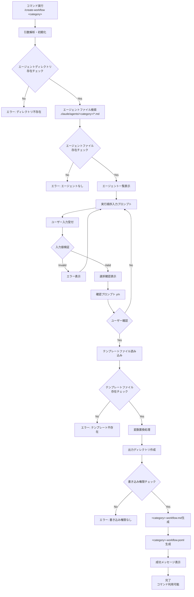

# create-workflow コマンド実行フロー詳細

## 全体フロー概要

`/create-workflow <category>` 実行時の処理フローを段階的に説明。



## 実行段階

### 1. 初期化
- `scripts/create-workflow.sh` 実行開始
- 引数 `spec` をエージェントディレクトリ名として解析
- 必要なライブラリモジュール読み込み

### 2. エージェント検索・表示
- `.claude/agents/spec/` 内の `.md` ファイルを検索
- エージェント名抽出（ファイル名から `.md` 除去）
- エージェント一覧を番号付きで表示

### 3. 対話的順序選択
- ユーザーがスペース区切りで番号入力（例：`1 3 4 6 2`）
- 入力検証とエラーハンドリング
- 選択内容の確認表示
- ユーザー確認（y/n）

### 4. テンプレート処理・ファイル生成
- テンプレートファイル読み込み（`.md`, `.poml`）
- 変数置換処理実行
- 出力ディレクトリ作成
- ファイル生成（コマンド定義とPOML）
- 成功メッセージ表示

## 生成ファイル例

### spec-workflow.md（概要）
- Claude Codeスラッシュコマンド定義
- POML呼び出しとエージェント順次実行ロジック
- 引数は全て `context` として処理

### spec-workflow.poml（概要）  
- 選択されたエージェントの順次実行定義
- コンテキスト継承ロジック
- 統合された出力フォーマット

## 主要なエラーハンドリング

- **引数不足**: 使用方法表示後終了
- **ディレクトリ不存在**: エラーメッセージ表示後終了  
- **エージェントファイルなし**: "エージェントが見つかりません" エラー
- **無効な順序入力**: 再入力要求
- **テンプレートファイル不存在**: エラーメッセージ表示後終了
- **書き込み権限エラー**: 権限エラーメッセージ表示

## モジュール構成

### 主要ライブラリ
- `agent-discovery.sh`: エージェント検索・表示
- `user-interaction.sh`: 対話処理・入力検証
- `template-processor.sh`: テンプレート処理・ファイル生成
- `common.sh`: 共通関数・エラー処理

## 動作例

```bash
# 1. コマンド実行（例: specカテゴリ）
/create-workflow spec

# 2. 対話的順序選択
実行順序を入力してください: 1 3 4 6 2
これで正しいですか？ (y/n): y

# 3. 成功メッセージ
✅ ワークフローコマンドを作成しました: /spec-workflow

# 4. 生成されたコマンドの使用
/spec-workflow "Todo アプリを作成して"

# その他のカテゴリの例
/create-workflow test    # → /test-workflow コマンド生成
/create-workflow deploy  # → /deploy-workflow コマンド生成
```